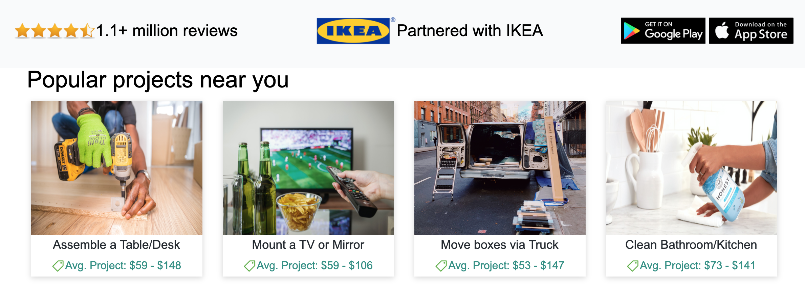
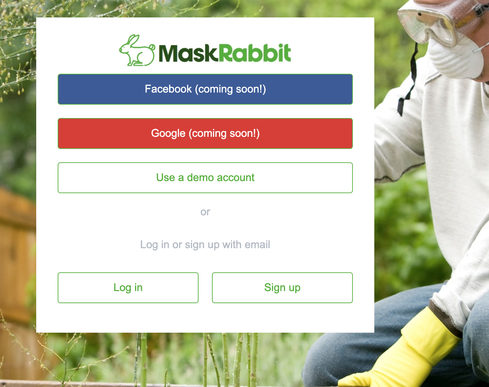
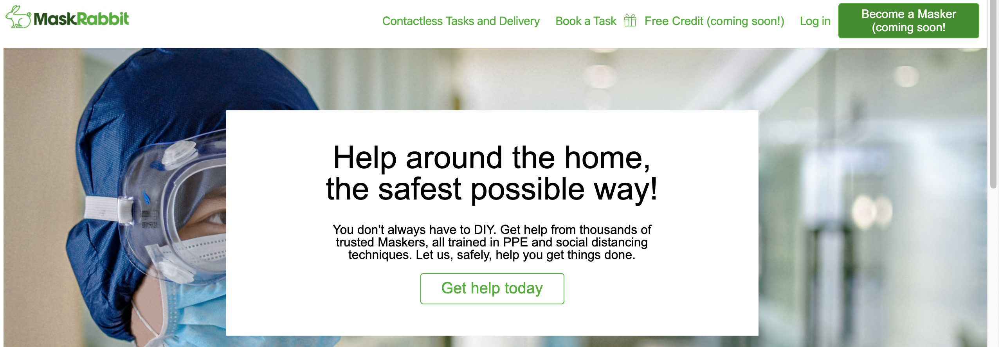
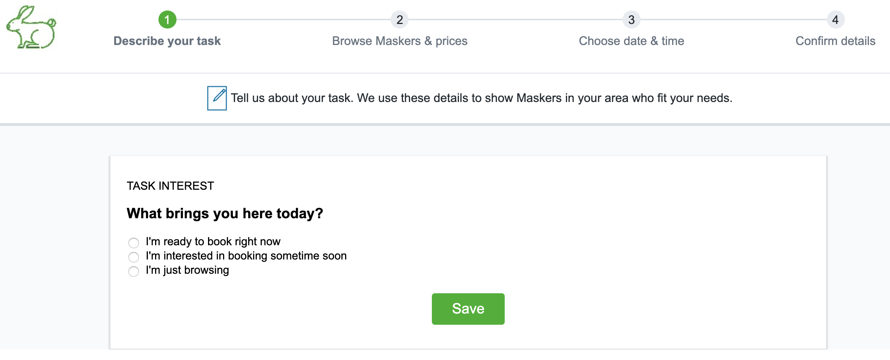

# MaskRabbit

### Description

MaskRabbit is a clone of the website TaskRabbit. A user will have the ability to create an account, create details for a task, and those criteria will be used to see if there are any available other users ("Maskers") who are willing to help them.

["Check it out here!"](https://maskrabbit.herokuapp.com/)

### Framework

MaskRabbit was built with the following technologies:
- Ruby on Rails
- PostgreSQL 12
- React
- Redux
- AWS image storage

### Features

MaskRabbit attempts to replicate the styling and layout of TaskRabbit wherever possible. This was accomplished using
the TaskRabbit logo as a template and finding icons that are similar to ones displayed on the page.

<!--  -->

 (## Your one-stop shop for services provided by people in PPE and trained in social distancing.
(### A TaskRabbit clone
### Attributions

"Rabbit with Mask" from The Avian and Exotic Animal Clinic

["Ecommerce, price, shop, tag icon"](https://www.iconfinder.com/icons/4177555/ecommerce_price_shop_tag_icon) by Jordan Alfarishy is licensed under CC BY 3.0

["Gift, present icon"](https://www.iconfinder.com/icons/172472/gift_present_icon) by Visual Pharm licensed under CC BY-ND 3.0

["Half star"](https://www.iconfinder.com/icons/49625/half_rating_star_icon) by Custom Icon Design

["Full star"](https://www.iconfinder.com/icons/49624/bookmark_favorite_full_rating_star_icon) by Custom Icon Design

["Animal, bunny, domestic, mammal, pet, rabbit, zoo icon"](https://www.iconfinder.com/icons/3406425/animal_bunny_domestic_mammal_pet_rabbit_zoo_icon) by Chanut is Industries under CC BY 3.0

["Woman in Mask Holding Toilet Paper"](https://www.pexels.com/photo/woman-in-mask-holding-toilet-paper-3962337/) by Anna Shvets

["Woman In Grey Shirt Holding Brown Cardboard Box"](https://www.pexels.com/photo/woman-in-grey-shirt-holding-brown-cardboard-box-761999/) by Andrea Piacquadio

["Flat Screen Television"](https://www.pexels.com/photo/flat-screen-television-1201996/) by JESHOOTS.com

["Person Using Dewalt Cordless Impact Driver on Brown Board"](https://www.pexels.com/photo/person-using-dewalt-cordless-impact-driver-on-brown-board-1249611/)
 by Bidvine

 ["Child in white hoodie holding white string lights"](https://unsplash.com/photos/YP3H19jkOwk) by CDC

 ["Man in gray hoodie and blue denim jeans standing on brown wooden parquet flooring"](https://unsplash.com/photos/jjrXvzbqC5E) by CDC

 ["Gray vehicle on black concrete road at daytime"](https://unsplash.com/photos/E7JP5mFbvBY) by Jon Tyson

 ["Blue Honest plastic spray bottle"](https://unsplash.com/photos/Ua9AK-pZ5cw) by The Honest Company

["Man in white shirt planting at daytime"](https://unsplash.com/photos/1JgUGDdcWnM) by Jed Owen

["Man in white dress shirt wearing blue face mask"](https://unsplash.com/photos/UhOIDLhhIcI) by H Shaw

